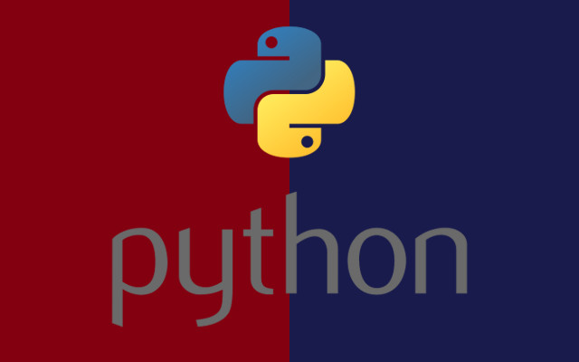

.. Projekt#1 documentation master file, created by
   sphinx-quickstart
   You can adapt this file completely to your liking, but it should at least
   contain the root `toctree` directive.

Witaj w dokumentacji do Projekt#1
=====================================

Oto dokumentacja projektu #1 realizowanego w ramach kursu 'Python średnio zaawansowany'

Poniżej lista zawartości dokumentacji

.. toctree::
   :maxdepth: 2
   :caption: Zawartość:

   code.rst

Indeksy
----------

* :ref:`modindex`
* :ref:`genindex`
* :ref:`search`

Dokumentacja utworzona na podstawie świetnego opisu: https://github.com/ericholscher/sphinx-tutorial/
